<p align="center">
<picture>
 <source media="(prefers-color-scheme: dark)" srcset="Imgs/Logos/courel-dark.png">
 
</picture>
</p>

Courel is a stepmania-compatible open-source sequencer for rhythm games.

## Notes

Notes are the core element that players must react and interact to in any rhythm game. They are placed in a Score, which is a particular arrangement of notes through time.

This is a note:

<p align="center">
 
</p>
 but also this is a note:
<p align="center">
 
</p>

In the most broad sense, a note is a point in time where the player must react to. In Courel, notes are represented by an instance of a class derived from `Courel.Loader.Notes.Note`, which is a generic class that can be specialized into different types of notes.

In Courel, we distinguish two big categories of notes:

1. `SingleNote`s: These are notes that that interact with the player only once, and hence they are judged only once too. For simplicity, we are going to represent them as circles, such as the blue note above.
2. `Hold`s: Unlike `SingleNotes`, these notes span over time, therefore the player must interact with them until they run out of scope. We represent them as two circles connected by a line, e.g. the blue hold above.

The manner in which the player interacts with notes is different for pretty much every rhythm game out there.

### SingleNotes

On the one hand, Courel offers three means of interaction with `SingleNotes` that can be remmaped to any specific interaction that a game needs. Those are:

1. `Tap`: A tap occurs for example when the player presses a button on a controller, or a key on a keyboard, or stomps on a pad in a dancing machine. Arguably, the tap interaction is the most common way of note. Arrows in DDR or PIU are notes that react to Tap events, for example. Courel offers an off-the-shelf `TapNote` class that can be used to represent this kind of notes. Tap events are passed to the sequencer via a method call in the `Sequencer` class. We represent this notes as filled circles:

<p align="center">
 
</p>

2. `Lift`: Lift events are less common than tap events, but they are used in some games. A lift event occurs when the player releases a button on a controller, or a key on a keyboard. In Courel, we have a class `LiftNotes` for this kind of notes. Similarly, to taps, lift events are also passed to the sequencer via a method call in the `Sequencer` class.

3. `Hold` (InputEvent): Holds are actually not events, but rather a state of the input. A hold occurs for example when the player presses and holds a button on a controller, or a key on a keyboard. Courel offers a `HoldNote` class for this kind of notes (not to be confused with `Hold` (Note)). As interactions of this kind are not events, the sequencer queries the state of the input via the interface `IHoldInput` to determine whether a hold is active or note. We represent `HoldNote`s as circumferences.

<p align="center">
 
</p>

### Holds

On the other hand, the interaction and judge with `Hold`s (Notes) is very game dependant. You can think of how different DDR or PIU holds feel like while playing each game. We will cover the judgmets of all notes down below, so it does not matter how it is done right now. What is important, is that Courel implements three different types of holds that are commonly used in rhythm games, which we will represented as two circles connected by a line:

<p align="center">
 
</p>

1. `DdrStyleHold`s: Courel names this type of hold after DDR, as it is the type of hold used in it. In short, this kind holds need two interactions by the user: a tap when the hold starts, followed by a hold and until it runs out of scope. It generates two judgment events, which we will leave for later.

2. `PiuStyleHold`s: Named after PIU, this hold mimmic the behaviour of the korean arcade. While its implementation is quite tricky, the interaction with the player is simple: hold (or tap from the beginning) until it runs out of scope. What is special about it is that it generates a judgment event which is in sync with the bpm, tickcount and other gimmicks which will be covered later on.

3. `DdrStyleRollHold`: This hold is not unique to DDR, but it follows its behaviour. It is a hold that starts with a tap, and then instead of held, the player must tap repeatedly until it runs out of scope. It generates events for the taps during its lifespan.

Under the hood, Courel maps `DdrStyleHold`s and `PiuStyleHold`s to a number of `SingleNotes` according to the behaviour of each one. Hence, Holds are not judged directly, but rather the `SingleNotes` that they are mapped to. More in detail:

- `PiuStyleHolds` are mapped to a number of `HoldNotes` with `Hidden` visibility (so they are not drawn in the screen), as shown below:

<p align="center">
 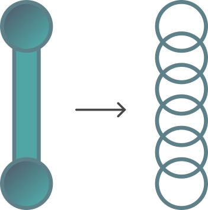
</p>

- `DdrStyleHolds` and `DdrStyleRollHolds` are mapped to a single head note of type `TapNote`, also with `Hidden` visibility. You can see an example below:

<p align="center">
 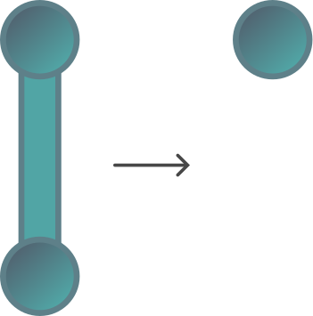
</p>

### Visibility

The visibility of a note is a property that determines whether notes are visible or judged. Courel supports natively three types of visibility for any `Note`:

1. `Normal`: The note is visible and judged normally.
2. `Hidden`: The note is not visible, but it is judged normally.
3. `Fake`: The note is visible, but it is not judged.

The notes that must be drawn in the screen can be queried via the `GetVisibleNotes` method in the `Sequencer` class. Beware that it is possible that some hidden notes (e.g. generated for `Hold`s) can be asked to be judged, and not be part of the visible notes returned by the sequencer.

## Score

As stated earlier, notes are arranged in a score. Courel defines scores through the `Score` class, which is an aggregate of `Lane`s and `Row`s. In the picture below you can see part of a score with 3 lanes and 5 rows which have been left empty for clarity (rows are never empty). Lanes are represented as vertical lines, and they are numbered from 0 to 2. You can ask Courel to have as many lanes as you want. Rows are represented as horizontal lines (perpedicular to the lanes), and unlike the number of lanes, it is not a parameter you need to decide in advance -- the amount vary depending on the actual notes you want to place in the score.

<p align="center">
 
</p>

### Usage of lanes

The usage of the lanes are very game dependant, but the most common use for them is to separate notes that must be actioned with different buttons/pads. As an example you can think of DDR having four lanes: one for each left, up, down, and right arrows. Tycho for instance has ony one lane, and all kinds of notes are placed in it. Courel does not impose any restriction on the usage of lanes, so you can use them as you wish. What you need to know is the sequeantiality restriction from the notes in the lane. Once a lane is filled up with notes, these are processed from top to bottom as the song progresses. A note in the $n$-th position of a lane won't be asked to be judged until the $n-1$-th note has been judged before. Notes in different lanes are independent from each other, so they can be judged in any order.

### Note positioning within Scores

Notes are placed in this grid by providing two pieces of information: the **beat** at which the note must be actioned, and the **lane** in which the note must be placed.

The `beat` is a number relative to the start of the song that indicates precisely when the note must be actioned. It is task of Courel to figure out when exactly the note must be actioned in after the start of the song ($v$ value, in seconds), and where it should be placed on the scrolling axis of the game ($w$ value). Do not worry on what this values are right now, as they will be somewhat covered later on. It is interesting to note that you are not providing directly the time when the note must be actioned, but rather the beat. This is because the beat is a number that is independent from the bpm of the song, and hence it is easier to work with for stepmakers. The task of retrieving $v$ and $w$, is not trivial at all if you are using the complete gimmick system that Courel implements.

The `lane` is a number that indicates in which lane the note belongs to. As stated earlier, lanes are numbered from 0 to $n-1$, where $n$ is the number of lanes in the score (a number that is defined beforehand). Placing a note in one lane or another is up to the designer of the game, as discussed earlier.

In the image below you can see five `TapNote`s placed in the score. The color of each `TapNote` just indicates the lane in which it is placed.

<p align="center">
 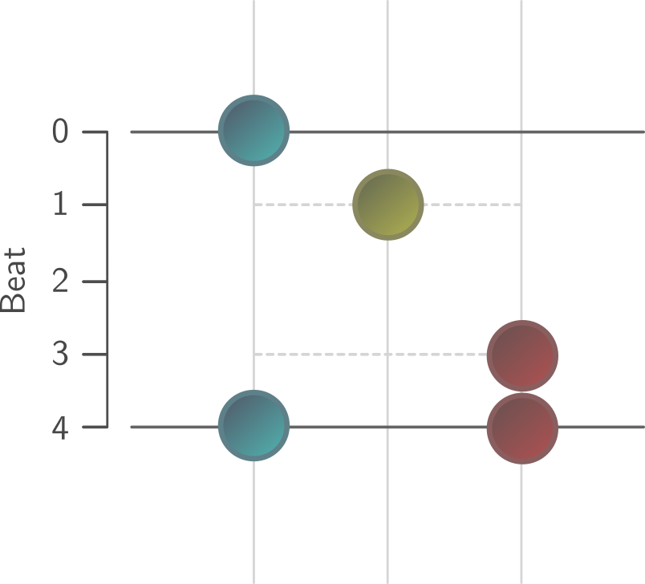
</p>

Note that we have notes placed at beat 0, 1, 3, 4. Since we do not have notes on beat 2, a row is not created for it.
Another noteworthy aspect of this note arrangement in lanes and rows is that notes with the same beat and different lanes are placed in the same `Row` object. When interacting with the `Sequencer` via subscriptions (`ISubscriber`), you will be notified in most of scenarios w.r.t. to `Row`s of notes instead of individual notes. This is because most rhythm games judge based on rows of notes instead of individual notes. Courel judges notes individually, but notifies the subscribers with `Row`s to make it more tunable for any game's needs.

When positioning notes of type `Hold`, you need to provide not only one two values of beat, one for the start of the hold, and one for the end of the hold. In the exampe below you can see a `Hold` placed in the score between beats 1 and 3.

<p align="center">
 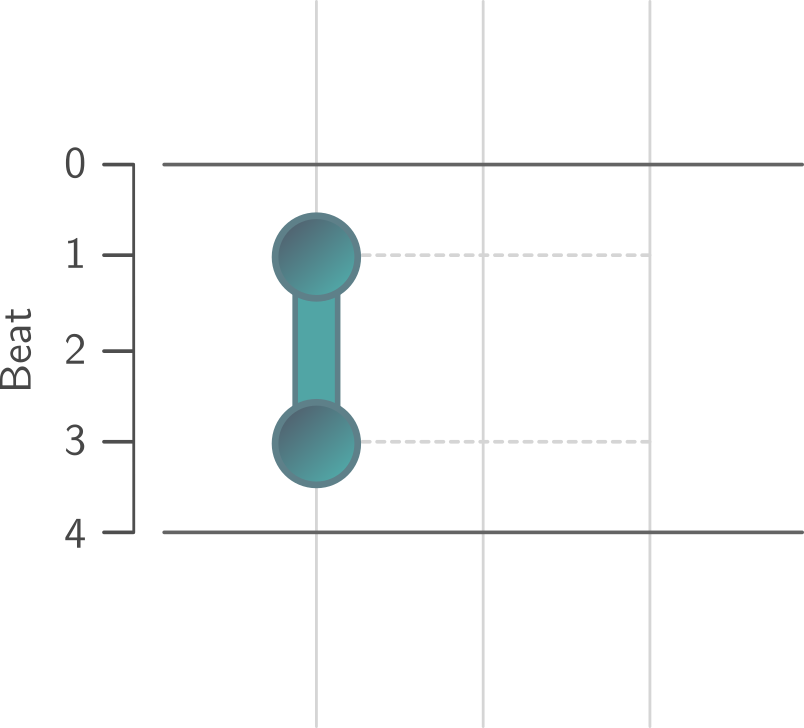
</p>

## Gimmick System

Gimmicks are means to modify the interpretation of the score at runtime. They are a very powerful tool which, when used properly, can be used to create great visual effects in the game without needing to modify the score itself. It also comes in handy for songs with unstable BPMs, or songs with pauses inbetween sections. Courel gimmick specification is inpired by Stepmania 5, so if you are familiar with it, you will feel right at home. Courel asks the gimmicks of a chart through the `IChart` class that must be implemented by the user.

Each gimmick is retrieved by a method in the interface, and they return a list of `GimmickPair` objects. Each `GimmickPair` is associated with a beat (which normally determines where the gimmick starts), and a value (which represents the final state of that gimmick, or a state maintained through time). Each `GimmickPair` defines the state of a gimmick at a specific point (beat) w.r.t. to the score, and each one works in its own way, so the meaning of the value is different for each gimmick.

Down below we will explain visually what the gimmicks are about, but you can always check out the method documentations to learn more. However, if you really feel like having an in-depth understanding of the gimmick system, you should definitely check out [this guide](https://github.com/piured/sequencer-guide). It goes through every gimmick by providing examples, and detailing the math behind them. Indeed, Courel is an open-source implementation of the mathematical expressions found in it.

### Gimmick lifespan types

The span of time or beats each gimmick affects to is differently. Also, some gimmicks are mandatory -- need at minimum one `GimmickPair` so the score can be generated properly. Think for example of a score without the BPMs gimmick properly set. There is no way of computing when and where the notes must be actioned or placed.

In general, depending on the nature of the gimmick, we separate them into three categories:

1. **Greedy**: Most gimmicks are greedy. Each `GimmickPair` defining a greedy gimmick try to span as far as possible (in both directions in time) from the beat they are placed at. For example, if a greedy gimmick is defined only with one `GimmickPair` value, that value will span from the defined beat until the end of the song (actually, $\infty$), and vice versa, from the beginning of the song ($-\infty$) until that beat. On the left hand side in the picture below you can see the only `GimmickPair` of a greedy gimmick, whose beat is 1 (dotted line). Notice that the blue line (which represents the value) spans from $-\infty$ to $\infty$.

   <p align="center">
   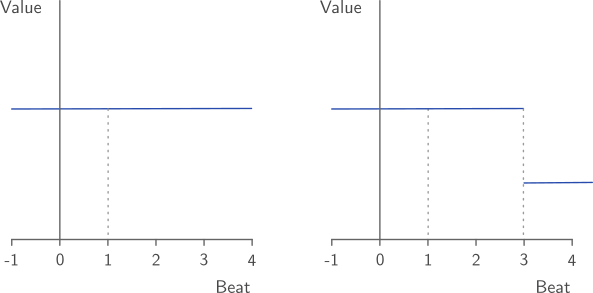
   </p>

   When two or more `GimmickPair`s are defined, the span to the right of the $n$-th `GimmickPair` will be delimited by the beat of the $n+1$-th `GimmickPair` (the next gimmick). On the right hand side in the picture above we have a `GimmickPair` at beat 1, and another at beat 3 (dotted lines), thus the span of the first gimmick is from beat $-\infty$ to beat 3, and the span of the second gimmick is from beat 3 to beat $\infty$.

   The following gimmicks are greedy:

   - BPMs
   - Scrolls
   - TickCounts
   - Combos

2. **Transitional Greedy**: Transitional greedy gimmicks behave in the same fashion as greedy gimmicks. Each `GimmickPair` will try to span as far as possible until another `GimmickPair` is found. However, they offer a linear transition from the value defined in the $n-1$-th `GimmickPair` to the $n$-th `GimmickPair`. For example, if we have a `GimmickPair` at beat 1 with value 1 and transition time 0, and another at beat 2 with value 2 and transition time 1 (in beats), the value of the gimmick at beat 2.5 will be 1.5. Only speed gimmicks are transitional greedy. You can see this in the picture below.

   <p align="center">
   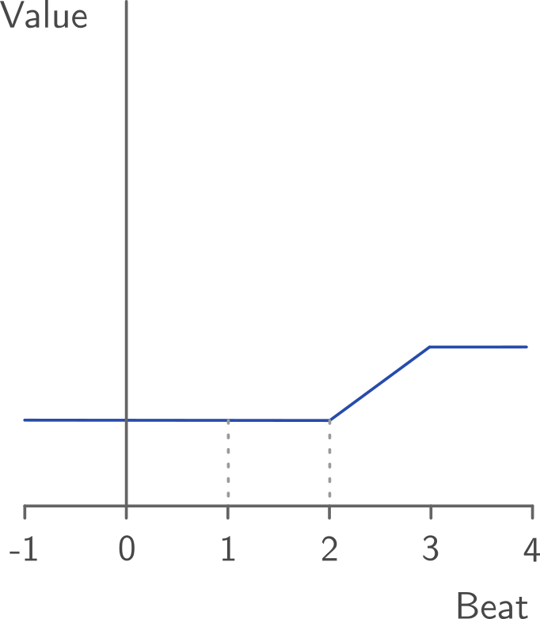
   </p>

3. **Range-based**: Range-based gimmicks affect only to a specific range of beats. When defining a `GimmickPair` the beat value will be the start of the range, and the value will be the span of time (either in seconds or beats, depending on the actual gimmick). For example, if we have a `GimmickPair` at beat 1 with value 2, the gimmick will affect from beat 1 to beat 3 (beat 1 included, beat 3 excluded, if not stated otherwise). The following gimmicks are range-based:

   - Stops
   - Delays
   - Warps
   - Fakes

### Examples set-up

In order to explain the gimmicks in a more visual way, all the examples below will be based on a score with 5 lanes and a total of 12 `TapNotes`, and 1 `PiuStyleHold`. Actually, we will use [piured-engine](https://github.com/piured/engine), a Pump It Up simulator that uses Courel as its sequencer to demonstrate how gimmicks work. The score itself is shown below:

```
[
  [
    ["0", "0", "1", "0", "0"],
    ["0", "0", "1", "0", "0"],
    ["0", "0", "1", "0", "0"],
    ["1", "0", "0", "0", "1"]
  ],
  [
    ["0", "0", "1", "0", "0"],
    ["0", "0", "1", "0", "0"],
    ["0", "0", "1", "0", "0"],
    ["1", "0", "0", "0", "1"]
  ],
  [
    ["0", "0", "2", "0", "0"],
    ["0", "0", "0", "0", "0"],
    ["0", "0", "3", "0", "0"],
    ["1", "0", "0", "0", "1"]
  ]
]
```

This score is in JSON format, and it is actually the result of parsing Stepmania's SSC NOTES section with [pegjs-ssc-parser](https://github.com/piulin/pegjs-ssc-parser). In this JSON-like SSC notation, the first level array represents the score. Each second level array represents 4 beats where notes can be placed at. Thus, the first sencond level array consists of notes placed at beats 0, 1, 2, and 3, and similarly the second second level array consists of notes placed at beats 4, 5, 6, and 7. Each position in the third level arrays represent the notes at each lane (we have 5), and the values in them represent the type of note placed at that beat and lane:

- `"0"` stands for no note
- `"1"` stands for a `TapNote`.
- `"2"` stands for the beginning of a `PiuStyleHold`.
- `"3"` stands for the end of a `PiuStyleHold`.

The default gimmick configuration, also shown in a similar JSON-like SSC format, is the following:

```
{
  "BPMs": [[0, 60]],
  "stops": [],
  "delays": [],
  "warps": [],
  "tickCounts": [[0, 1]],
  "combos": [[0, 1]],
  "speeds": [[0, 1, 0, 0]],
  "scrolls": [[0, 1]],
  "fakes": [],
}
```

They keys in this dictionary indicate the target gimmick, whereas the values correspond to the list of `GimmickPairs` associated with them. For example, the BPMs gimmick is defined with one `GimmickPair` whose beat is defined in the first position of the second level array (`0`), and value is defined in the second position (`60`). This applies to all gimmicks, except for `speeds`, which are defined with four values: beat, value, transition time, and transition type. It is not necessary to understand what they do right away, as we will go through each one just below.

This chart (score+gimmicks) results in the following interpretation of the score:

<p align="center">

</p>

The gimmick system in Courel is Stepmania 5-compatible, including the following gimmicks:

### BPMs

BPM (or Beats Per Minute) is a measure of the tempo of any song. In short, is the amount of beats that occur in a minute. This value is key to keep your notes in sync with the music! A badly set BPM value is going to ruin the whole playing experience in any rhythm game. In Courel, the definition of the BPM is a gimmick itself because it is allowed to set multiple BPMs for a song (so-called BPM changes). This is useful for songs with multiple sections with different tempos, or to create some visual effects.

Note that the BPMs gimmick is a greedy gimmick.
If your song does not contain BPM changes, you need to specify anyways one "global" BPM value. This is done by returning a list with one `GimmickPair` item in the `GetBPMs` method of the `IChart` interface. The value of the `GimmickPair` returned is the BPM value, and the beat is traditionally set to 0, although any other value will work just fine. You can define as many BPM changes as wished by adding `GimmickPairs` at the beats where the BPM change occurs, and setting the value to the new BPM value.

In the example below, we just modified the BPMs gimmick definition by adding a BPMs change at beat 4 with value 120:

```
"BPMs": [[0, 60], [4, 120]],
```

As seen below, when the song time reaches beat 4, the pace at which the notes scroll increases from 60 BPM to 120 BPM.

<p align="center">
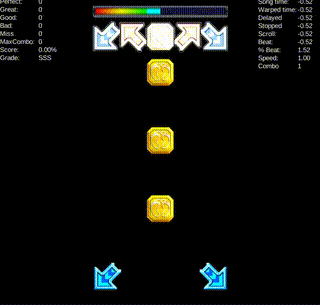
</p>

### Scrolls

Scrolls are a way to modify the _relative position_ at which the notes are placed in the scrolling axes ($w$ value) as well as the scrolling pace.

The value of each `GimmickPair` determines the rate of scrolling w.r.t. to the current BPM value, and its relative position is adjusted by that rate so the notes appear in the right position w.r.t. the judging row. Therefore a value of 1 will not have any visible effect because we would be scrolling exactly at the current BPM value, and the position will not be adjusted. Values closer to 0 will make notes scroll slower and appear closer together, whilst values greater than 1 will make notes scroll faster and appear further apart. Negative values will make notes scroll backwards.

A similar effect can actually be done by creating artificial BPM changes, but in most cases this is pretty inconvenient. Remember that the BPM is a measure of the tempo of the song, and it must stay always sync with the music. When adding BPM changes, you need to rewrite the all the notes after the BPM change so they can be interacted with in the same beat, and in some extreme cases, adding too many BPM changes (specially with weird values) makes the score harder to read and maintain. There is also some some scenarios where you cannot achieve even the same results by adding BPM changes than with scrolls.

Scrolls are greedy gimmicks. If you don't want anything to do with them, just return in the `GetScrolls` method of the `IChart` interface a list with one `GimmickPair` with the beat set 0 zero and the value set to 1.

In the example below we modified the Scrolls gimmick definition by adding a scroll change at beat 4 with a value of 0, and at beat 7 with a value of 0.5:

```
"scrolls": [
  [0, 1],
  [4, 0],
  [7, 0.5]
]
```

The resulting effect is shown below. Note that from beat 4 to 7 all the notes are crunched into the same position in the scrolling axis due to the scroll value of 0. However, notes are still judged normally at beats 4, 5, 6, and 7, respectively. From beat 7 on, the scrolling and notes' relative position are reduced by a factor of 0.5.

<p align="center">
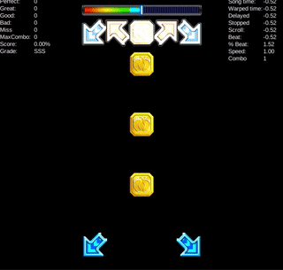
</p>

### TickCounts

TickCounts is a greedy gimmick affecting only `PiuStyleHolds`. As explained before, `PiuStyleHolds` generate judgment events at a certain rate in order to mimmick the behaviour of holds in the Pump It Up original arcade. Under the hood, this is done by generating many `HoldNotes` with `Hidden` visibility. The rate at which these `HoldNotes` are generated is determined by the `TickCount` gimmick. The value of each `GimmickPair` determines the rate of `HoldNotes` generated per beat. A value of 1 will generate one `HoldNote` per beat, a value of 2 will generate two `HoldNotes` per beat, and so on. Negative values are not allowed.

If your game uses `PiuStyleHolds` you must return an non-empty list in the `GetTickCounts` method of the `IChart` interface.

In the example below, we modified the TickCounts gimmick definition by adding a tick count change at beat 9 with a value of 16:

```
"tickCounts": [
  [0, 1],
  [9, 16]
]
```

Note how at the middle of the hold (beat 9), the amount of judgments generated increases from 1 to 16 per beat.

<p align="center">

</p>

### Combos

Combos is a greedy gimmick that affects the combo contribution property of `SingleNotes` which can be accesed through the method `GetCombo`. It is important that with independence of the combos value, notes are always judged once. The value of each `GimmickPair` determines the amount of combo contribution that each `SingleNote` will have. A value of 1 will make each `SingleNote` contribute 1 to the combo, a value of 2 will make each `SingleNote` contribute 2 to the combo, and so on.

You must always return a non-empty list in the `GetCombos` method of the `IChart` interface, even if you are not using this property.

In the example below, we modified the Combos gimmick definition by adding a combo change at beat 4 with a value of 2:

```
"combos": [
  [0, 1],
  [4, 2]
]
```

Note how the combo contribution of each note is doubled from beat 4 on.

<p align="center">

</p>

### Speeds

Speeds is a transitional greedy gimmick that affects the drawing positions of notes as well as the scrolling pace at runtime. Unlike Scrolls, it modifies the _absolute position_ of the notes in the scrolling axis globally (all notes). The value of each `GimmickPair` determines the rate of scrolling w.r.t. to an unitary value (which will be discussed later on) as well as the spacing of the notes. Augmenting the speed value will cause the scroll rate to speed up, and so the spacing between notes.

Since Speeds gimmicks are transitional greedy, they are able to transition from one value to another smoothly (linearly). The transition time can be specified in terms of beats or seconds, although the most common way is to use beats. You are allowed to set the transition time to 0, which will cause the transition to be instantaneous. Negative speed values will cause the scrolling axis to reverse.

You must always return a non-empty list in the `GetSpeeds` method of the `IChart` interface. If you are not using this gimmick, just return a list with one `GimmickPair` with the beat set to 0, the value set to your desired global speed, the transition time set to 0, and the transition type set to 0.

In the example below, we modified the speeds in the following fashion:

```
"speeds": [
  [0, 1, 0, 0],
  [1, 0.25, 1, 0],
  [3, 0, 1, 0],
  [5, -0.5, 0.5, 0],
  [7, 4, 0.5, 0],
  [9, 1, 1, 0]
]
```

where the first element of each `GimmickPair` is the beat, the second element is the value, the third element is the transition time, and the fourth element is the transition type (`0` stands for beat). The resulting effect is shown below.

<p align="center">

</p>

### Stops

Stops is a range-based gimmick which artificially stops the song time for a certain amount of seconds. Any note placed at the stopped beat will be judged normally. Notes coming after the stopped beat will be judged normally after the stop has ended. The best use case for Stops (and also Delays) is to sync the BPM with a song, when the music has changed its tempo, or when the music has stopped at some point (e.g. a pause).

The value of each `GimmickPair` determines the amount of seconds the song time will be stopped. A value of 1 will stop the song time for 1 second, a value of 2 will stop the song time for 2 seconds, and so on. Negative values are not allowed.

You must always return a non-empty list in the `GetStops` method of the `IChart` interface. If you are not using this gimmick, just return an empty list.

In the example below (left hand side, in Delays section), we modified the Stops gimmick definition by adding a stop at beat 3 with a value of 1, and at beat 9 with a value of 0.5:

```
"stops": [
  [2, 1]
  [9, 0.5]
]
```

Notice how the stopped song time stops for 1 second at beat 3. Also, note that the note placed at beat 3 is judged before the stops takes place.

### Delays

Delays is a range-based gimmick which operates exactly the same as Stops. The only difference is that as its name might suggest, the song time is delayed instead of stopped. This causes that a note placed at the beat where a delay occurs, will be judged right after the delay has ended. Similarly to notes, judged coming after the delayed beat will be judged normally after the delay has ended. The use case for Delays is the same as for Stops.

The value of each `GimmickPair` determines the amount of seconds the song time will be delayed w.r.t. to the beat it is placed at. A value of 1 will delay the song time for 1 second, a value of 2 will delay the song time for 2 seconds, and so on. Negative values are not allowed.

You must always return a non-empty list in the `GetDelays` method of the `IChart` interface. Charts not using this gimmick shall return an empty list.

To show the difference w.r.t. to the Stops gimmick above, we modified the Delays gimmick by adding exactly the same delays as in the Stops gimmick:

```
"delays": [
  [2, 1]
  [9, 0.5]
]
```

On the right hand side you can see that the note placed at beat 3 is judged after the delay has ended. Since we are using a BPM of 60, the delay of 1 second, the note will be judged as if it was placed at beat 4.

<p align="center">

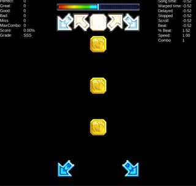
</p>

### Warps

Warps is a range-based gimmick that allows to skip a certain amount of beats in the score. Notes placed inside the range defined by the `GimmickPair` become `Fake` notes, therefore they will not be judged (obviously, because they cannot be actioned in time). Notes coming after the warped beat will be judged normally. Warps are mostly used to create visual effects.

The value of each `GimmickPair` determines the amount of beats that will be warped over. A value of 1 will skip 1 beat, a value of 2 will skip 2 beats, and so on. Negative values are not allowed.

You must always return a non-empty list in the `GetWarps` method of the `IChart` interface. Charts not using this gimmick shall return an empty list.

In the example below, we modified the Warps gimmick definition by adding a warp at beat 3 with a value of 4, so will it skill skip 4 beats.

```
"warps": [[3, 4]]
```

Notice how notes placed at beat 3, 4, 5, and 6 appear disappear and the hold appears in less than the flick of a finger, creating the ilusion of note replacement.

<p align="center">
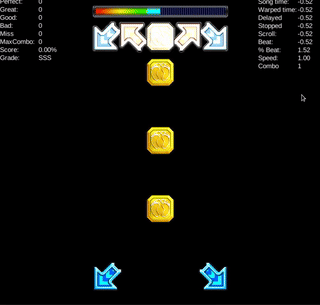
</p>

### Fakes

The last gimmick is Fakes, which is a range-based gimmick that allows to assign `Fake` visibility to notes by range. Notes placed inside the range defined by each `GimmickPair` become `Fake` notes, therefore they will not be judged. Notes coming after the fake beat will be judged normally. Similarly to Warps, Fakes are mostly used to create visual effects.

The value of each `GimmickPair` determines the amount of beats that will be faked over w.r.t. the beat it is placed at. A value of 1 will fake 1 beat, a value of 2 will fake 2 beats, and so on. Negative values are not allowed.

You must always return a non-empty list in the `GetFakes` method of the `IChart` interface. Charts not using this gimmick shall return an empty list.

To show the difference w.r.t. to the Warps gimmick above, we added a Fake gimmick at beat 3 with a value of 4, so notes placed at beats 3, 4, 5, and 6 become `Fake` notes (but they will not be warped over).

```
"fakes": [[3, 4]]
```

<p align="center">

</p>

### Gimmick combination

Gimmicks can be combined in any way you want to create wonderful visual effects. Down below there are some examples of the things that some stepmakers can achieve.

<p align="center">

</p>

## Drawing and scrolling notes on the screen

So far we have already covered the basics of the notes, score, and gimmicks. Both setting the notes in the score (by assigning to each one of them a beat and lane) and setting up all the gimmicks is just enough to determine where each note should be placed on the scrolling axis at any song time $t$, as well as when they should be actioned by the user. Calculating these values goes out of the scope of this manual, but as said earlier, if you wanna have a look at the math behind it, you can learn more [here](https://github.com/piured/sequencer-guide).

Courel is just a sequencer, so it does not provide any means to draw the notes on the screen, or to scroll them. It is up to the end user to implement this. What Courel will give you though is all the values you need to do it.

### Unitary value assumption

Courel assumes the following spatial properties for the game objects of the rhythm game:

<p align="center">
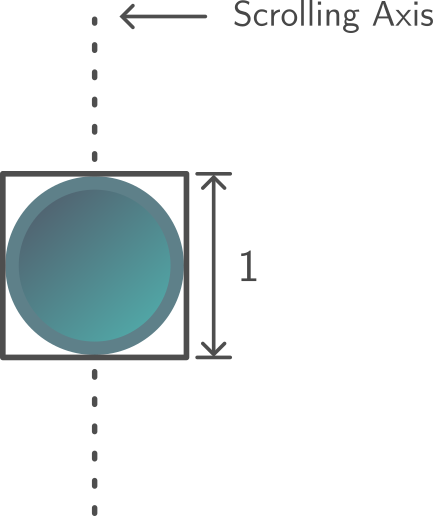
</p>

The scrolling axis (shown as a dotted vertical line) is a virtual line which represents the path taken by the notes as they scroll w.r.t. to the song time towards the receptor (more on this later on). This axis can be placed anywhere in the screen, and it can be oriented in any direction. That is up to the designer of the game. You can think of DDR having the scrolling axis from bottom to top, so the notes scroll upwards when the song time increases, or Tycho having it from left to right.

- What is important is that the size of the note aligned with the scrolling axis is assumed to be one unit. This is what we refer to as the unitary value. In the example above you can see that the height of gray bounding box around the note is of size one.

- Another assumption made by Courel is that notes that are one beat apart from each other, will be positioned one unit apart in the scrolling axis, as seen below.

<p align="center">
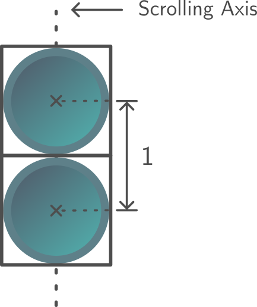
</p>

### Relative and absolute position

Once you have loaded a chart through the method `LoadChart` in the `Sequencer` class, Courel reads the notes and gimmicks, and updates the internal properties of the notes in the score. The next time you query the notes to be drawn in the screen via the `GetDrawableNotes`, these properties can be used to determine the position of the notes in the scrolling axis.

The most important property is the $w$ value, which can be queried via the `GetW` method in any `Note` class (holds have two $w$ values -- begin and end). We called it $w$ just to keep it consistent with the equations behind it. $w$ is referred to as the relative position.

The **relative position** of a note is the position the note must be drawn in the scrolling axis when the song time $t=0$. Obviously, this value alone is not very useful, because it does not tell us where the note must be drawn at any other song time.

The position of a note in the scrolling axis at any given song time $t$ is referred to as its **absolute position**. Courel does not calculate this value for every note for you due to performance reasons -- most of the time you will be culling pretty much all of the drawable notes, so you do not need to calculate these values for all them. Instead, it provides you with the values you need to calculate it yourself.

The absolute position of a note can be calculated by quering the current scroll $c$ and speed $s$ values (via `GetScroll` and `GetSpeed` methods in the `Courel.Sequencer` class), and the relative position $w$ of the note. The equation is the following:

$$
\text{Absolute position} = (-w + c) \times s.
$$

Since $c$ and $s$ are function of $t$, the absolute position of the note will change as the song time progresses.

### Scrolling notes

The calculus of the absolute position must be done at every frame (in your `Update` method, for example). By doing so and updating your game object position transform in the scrolling axis accordingly, you will be scrolling them at the right pace. Just as simple as that.

## Judging Notes

### action time

### premature notes

### missed notes

### receptor

### positioning receptor
