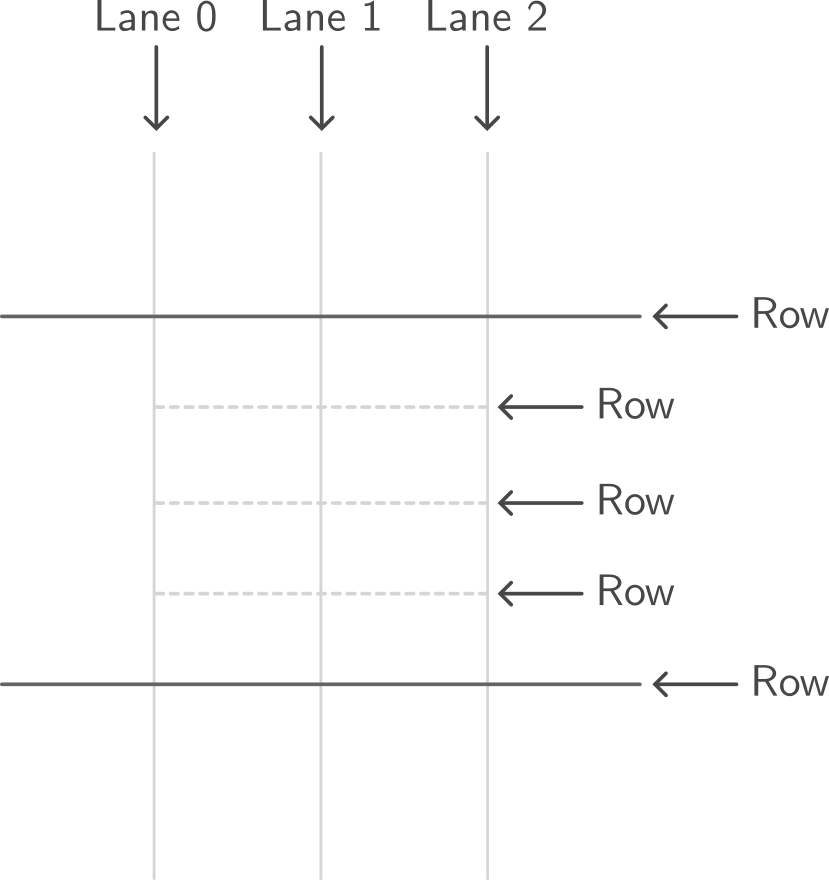

<picture>
 <source media="(prefers-color-scheme: dark)" srcset="https://raw.githubusercontent.com/piured/courel/main/Imgs/Logos/courel-dark.png">
 
</picture>

Courel is a stepmania-compatible open-source sequencer for rhythm games.

## Notes

Notes are the core element that players must react and interact to in any rhythm game. They are placed in a Score, which is a particular arrangement of notes through time.

This is a note:

 

 but also this is a note:

 

In the most broad sense, a note is a point in time where the player must react to. In Courel, notes are represented by an instance of a class derived from `Note`, which is a generic class that can be specialized into different types of notes.

In Courel, we distinguish two big categories of notes:

1. `SingleNote`s: These are notes that that interact with the player only once, and hence they are judged only once too. For simplicity, we are going to represent them as circles, such as the blue note above.
2. `Hold`s: Unlike `SingleNotes`, these notes span over time, therefore the player must interact with them until they run out of scope. We represent them as two circles connected by a line, e.g. the blue hold above.

The manner in which the player interacts with notes is different for pretty much every rhythm game out there.

### SingleNotes

On the one hand, Courel offers three means of interaction with `SingleNotes` that can be remmaped to any specific interaction that a game needs. Those are:

1. `Tap`: A tap occurs for example when the player presses a button on a controller, or a key on a keyboard, or stomps on a pad in a dancing machine. Arguably, the tap interaction is the most common way of note. Arrows in DDR or PIU are notes that react to Tap events, for example. Courel offers an off-the-shelf `TapNote` class that can be used to represent this kind of notes. Tap events are passed to the sequencer via a method call in the `Sequencer` class. We represent this notes as filled circles:

 

2. `Lift`: Lift events are less common than tap events, but they are used in some games. A lift event occurs when the player releases a button on a controller, or a key on a keyboard. In Courel, we have a class `LiftNotes` for this kind of notes. Similarly, to taps, lift events are also passed to the sequencer via a method call in the `Sequencer` class.

3. `Hold` (InputEvent): Holds are actually not events, but rather a state of the input. A hold occurs for example when the player presses and holds a button on a controller, or a key on a keyboard. Courel offers a `HoldNote` class for this kind of notes (not to be confused with `Hold` (Note)). As interactions of this kind are not events, the sequencer queries the state of the input via the interface `IHoldInput` to determine whether a hold is active or note. We represent `HoldNote`s as circumferences.

 

### Holds

On the other hand, the interaction and judge with `Hold`s (Notes) is very game dependant. You can think of how different DDR or PIU holds feel like while playing each game. We will cover the judgmets of all notes down below, so it does not matter how it is done right now. What is important, is that Courel implements three different types of holds that are commonly used in rhythm games, which we will represented as two circles connected by a line:

 

1. `DdrStyleHold`s: Courel names this type of hold after DDR, as it is the type of hold used in it. In short, this kind holds need two interactions by the user: a tap when the hold starts, followed by a hold and until it runs out of scope. It generates two judgment events, which we will leave for later.

2. `PiuStyleHold`s: Named after PIU, this hold mimmic the behaviour of the korean arcade. While its implementation is quite tricky, the interaction with the player is simple: hold (or tap from the beginning) until it runs out of scope. What is special about it is that it generates a judgment event which is in sync with the bpm, tickcount and other gimmicks which will be covered later on.

3. `DdrStyleRollHold`: This hold is not unique to DDR, but it follows its behaviour. It is a hold that starts with a tap, and then instead of held, the player must tap repeatedly until it runs out of scope. It generates events for the taps during its lifespan.

Under the hood, Courel maps `DdrStyleHold`s and `PiuStyleHold`s to a number of `SingleNotes` according to the behaviour of each one. Hence, Holds are not judged directly, but rather the `SingleNotes` that they are mapped to.

### Visibility

The visibility of a note is a property that determines whether notes are visible or judged. Courel supports natively three types of visibility for any `Note`:

1. `Normal`: The note is visible and judged normally.
2. `Hidden`: The note is not visible, but it is judged normally.
3. `Fake`: The note is visible, but it is not judged.

The notes that must be drawn in the screen can be queried via the `GetVisibleNotes` method in the `Sequencer` class. Beware that it is possible that some hidden notes (e.g. generated for `Hold`s) can be asked to be judged, and not be part of the visible notes returned by the sequencer.

## Score

 

### Note positioning
